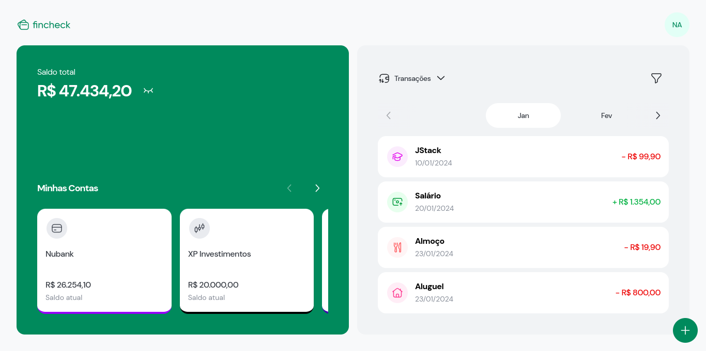

# Fincheck

<p align="center">
  
</p>

Fincheck é uma aplicação web para ajudar você a gerenciar suas finanças pessoais de maneira mais eficiente. Ela permite que você centralize todos os seus rendimentos e gastos em um único lugar, registrando as suas contas e transações bancárias, o que facilita o controle das suas despesas diárias, a análise dos seus padrões de gastos e o acompanhamento das suas metas financeiras.

A aplicação foi pensada para proporcionar ao usuário uma experiência agradável e funcional, seja em um computador ou celular.

Este projeto foi desenvolvido durante o curso [JStack](https://jstack.com.br/).

## Tecnologias

- Linguagem: TypeScript
- Gerenciador de pacotes: npm
- Bibliotecas: React, React Router, Tailwind CSS, Headless UI, Radix UI,  Axios, Zod, React Query, React Hook Form, react-hot-toast, React Number Format, date-fns, React DayPicker e Swiper
- Ferramentas: Git, Vite, ESLint, Prettier, EditorConfig, commitlint, lint-staged, husky e Figma

## Dependências

Antes de tudo, é necessário estar com a [API](https://github.com/nataelienai/fincheck-api) do projeto já em execução para que esta aplicação funcione.

Para executar esta aplicação, você precisará de [Git](https://git-scm.com/downloads) e [Node.js](https://nodejs.org/) instalados no seu computador.

## Como executar

1. Abra um terminal e clone o repositório:
```sh
git clone https://github.com/nataelienai/fincheck-web.git
```

2. Entre na pasta do repositório clonado:
```sh
cd fincheck-web
```

3. Instale as dependências do projeto:
```sh
npm install
```

4. Inicialize a aplicação:
```sh
npm run dev
```
